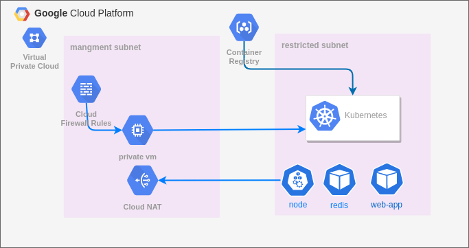
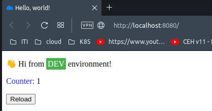
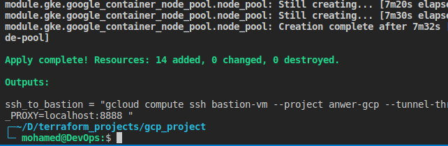
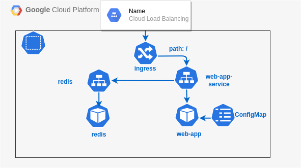
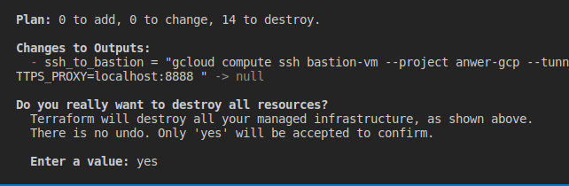

# Provision GKE cluster on GCP 



[**Task description** ](#task)

## Containerize the web application [link](https://github.com/atefhares/DevOps-Challenge-Demo-Code)
- Create Dockerfile for the web application
- Create a Docker-compose.yaml file with two services:
  - one for the web application
  - one for the database redis 
### Test App locally using docker-compose 💻
```bash
cd ./app
docker-compose up
```
```
open http://localhost:8080 in your browser to see the web application 🥁
```


### Clean up 💣
```bash
docker-compose down
```

### Push image to private repo  `GCR`
```bash
# Authenticate to GCR using gcloud
gcloud auth configure-docker gcr.io
# Tag the image 
docker tag web-app  gcr.io/anwer-gcp/web-app:latest
# Push the image to GCR
docker push gcr.io/anwer-gcp/web-app:latest
```

### Provision infrastructure on GCP 🚀
1. Create a GCP project
2. Create GS bucket and enable versioning to store the terraform state file
3. Clone repo 
4. edit project_id in terraform.tfvars with your project id and edit provider configuration 

#### Finally  Run the following command to provision the infrastructure 🚀
```bash
# initialize terraform
terraform init
# check plan
terraform plan 
# apply the plan it will take some time to complete 😴
terraform apply --auto-approve
```




### Use output command to auth with the cluster 🔐 and open connection through proxy 💻

```bash
gcloud container clusters get-credentials gke-cluster --zone us-central1-a --project anwer-gcp ; gcloud compute ssh bastion-vm --project anwer-gcp --tunnel-through-iap --zone us-central1-a -- -4 -L8888:localhost:8888 -N -q -f && export HTTPS_PROXY=localhost:8888
```

### Deploy the web app using kubectl 🚀



### Start deploy by using the following command 🚀
```bash
kubectl apply -Rf ./k8s
```


```bash
kubectl get ingress
```
### Clean up 💣

```bash
kubectl delete -f ./k8s

terraform destroy 
```



## Task 
📋

1 VPC
2 subnets (management subnet & restricted subnet):
1. Management subnet has the following:
• NAT gateway
• Private VM

2. Restricted subnet has the following:
• Private standard GKE cluster (private control plan)
Notes:

1. Restricted subnet must not have access to internet
2. All images deployed on GKE must come from GCR or Artifacts registry.
3. The VM must be private.
4. Deployment must be exposed to public internet with a public HTTP load balancer.
5. All infra is to be created on GCP using terraform.
6. Deployment on GKE can be done by terraform or manually by kubectl tool.
7. The code to be build/dockerized and pushed to GCR is on here:
https://github.com/atefhares/DevOps-Challenge-Demo-Code
8. Don’t use default compute service account while creating the gke cluster, create
custom SA and attach it to your nodes.
9. Only the management subnet can connect to the gke cluster.

